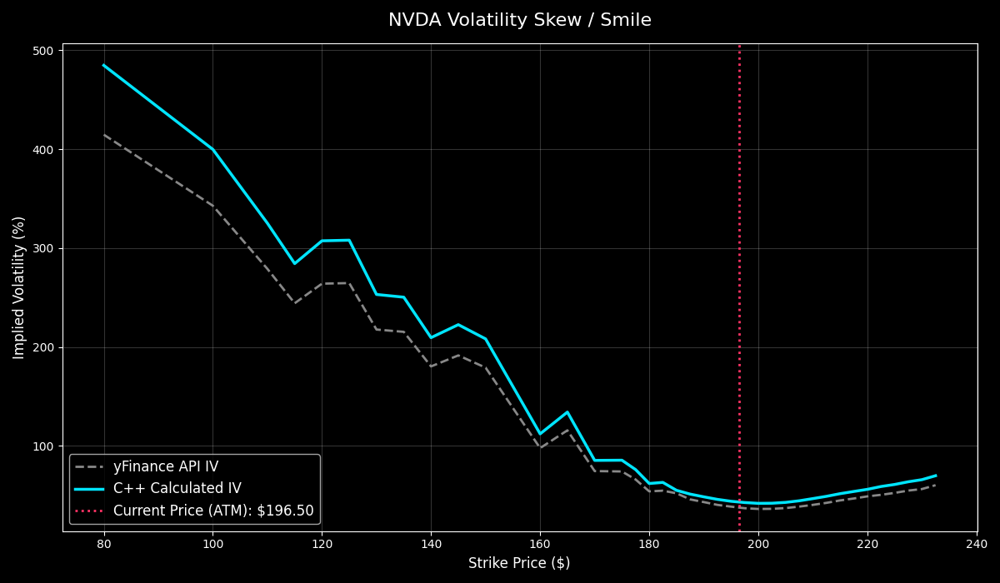

# Black-Scholes PDE Solver

A high-performance Python library for pricing financial options. The core engine is written in C++ and approximates the Black-Scholes Partial-Differential Equation using the Crank-Nicolson Finite Difference Method. The resulting tridiagonal linear system is solved in $O(N)$ time complexity using the Thomas Algorithm.

This project leverages `pybind11` and `scikit-build-core` to expose the C++ numerical engine directly to Python, allowing for rapid data acquisition (e.g., via `yfinance`) alongside sub-millisecond-level PDE solving.

## Architecture & Performance

The numerical engine is built to handle computationally intensive stochastic grid calculations with ultra-low latency for live trading desk environments. By bypassing the Python Global Interpreter Lock (GIL) and executing raw 64-bit C++ machine code, the library achieves a roughly **100x execution speedup** over native Python implementations.

**Hardware-Level Optimizations:**
* **SIMD Vectorization:** The explicit step of the Crank-Nicolson grid is heavily optimized for AVX2/FMA and AVX-512 hardware registers. By utilizing compiler pragmas and loop-peeling to remove branch mispredictions, the CPU processes up to 8 grid nodes per clock cycle.
* **Zero-Allocation Hot Paths:** The time-stepping loop (backward induction) utilizes static, pre-allocated memory buffers passed by reference. The core solver executes with absolutely zero heap allocations or `std::stack` overhead.
* **Fast-Math Operations:** Reordered algebraic pipelines optimize floating-point throughput.

**Benchmark (2000 Price Steps x 2000 Time Steps):**
* **Pure Python:** ~4.12 seconds
* **Compiled C++:** ~0.04 seconds (40 milliseconds)
* **Speedup:** ~100x FASTER

## Installation

To build and install the library directly from the source code, ensure you have a modern C++ compiler (GCC, Clang, or MSVC) and CMake installed. 

Navigate to the root directory and run:

```bash
pip install . --no-cache-dir
```
*(Note: The `--no-cache-dir` flag ensures Python does not use a stale cached build and forces the compiler to generate fresh vector instructions for your specific CPU architecture).*

### C++ Unit Testing
If you are modifying the core C++ engine, you can run the GoogleTest suite directly via CMake:
```bash
cmake -S . -B build
cmake --build build
./build/all_tests
```

## Quick Start

Once installed, you can import the compiled C++ engine directly into any Python script.

```python
import black_scholes_solver

# 1. Define the grid parameters
grid = black_scholes_solver.GridParams()
grid.price_ceiling = 380.0
grid.time_to_maturity = 0.0082
grid.num_price_steps = 760
grid.num_time_steps = 200

# 2. Define the market parameters
market = black_scholes_solver.MarketParams()
market.volatility = 0.2754
market.risk_free_interest = 0.0359
market.strike_price = 190.0
market.dividend_yield = 0.0
market.option_type = black_scholes_solver.OptionType.Call

# 3. Solve the PDE (Executes natively in C++)
# Returns a Python list containing the option value at every price step
V = black_scholes_solver.formulate_black_scholes(grid, market)
```

### Calculating Implied Volatility
The library also includes a high-speed root-finder using Brent's Method to calculate arbitrage-free implied volatility directly from market prices.

```python
import black_scholes_solver

iv = black_scholes_solver.calculate_implied_volatility(
    target_price=2.5450,
    S=196.50,
    K=197.50,
    T=0.0081,
    r=0.0360,
    q=0.0,
    type=black_scholes_solver.OptionType.Call
)
print(f"Implied Volatility: {iv:.4f}")
```



## Limitations & Mathematical Assumptions

While this engine is built for microsecond execution and high-precision PDE solving, it currently relies on several standard quantitative assumptions that may introduce minor drift when compared to institutional pricing feeds (e.g., OptionMetrics, Bloomberg):

* **European IV Approximation for American Options:** The `calculate_implied_volatility` root-finder utilizes Brent's Method over the closed-form European Black-Scholes equation. Because American options contain an early-exercise premium, using a European formula to extract IV from an American market price will slightly artificially inflate the resulting volatility. (Note: The PDE *does* properly price American options via the Brennan-Schwartz constraint, but the fast root-finder assumes European exercise).
* **Continuous Dividend Yields:** The solver models dividends as a continuous annualized yield ($q$). It does not currently support discrete dividend schedules (lumpy cash flows on specific ex-dividend dates). For underlyings with massive, irregular dividends, this continuous approximation will cause slight pricing drift.
* **Constant Interest Rates:** The `MarketParams` struct accepts a single, scalar constant for the risk-free rate ($r$). The engine does not natively support a full yield curve or term structure of interest rates. 
* **Mid-Price Illiquidity:** The implied volatility pipeline is optimized to target the exact Bid-Ask Mid-Price. In highly illiquid options with blown-out spreads, the arithmetic midpoint may not represent the true market clearing price, which can cause Brent's Method to map an exaggerated volatility smirk.

## References

Brennan, M. J., & Schwartz, E. S. (1977). The valuation of American put options. The Journal of Finance, 32(2), 449–462. [https://www.jstor.org/stable/2326779](https://www.jstor.org/stable/2326779)

SkanCity Academy. (2023, October 6). 🟢05 - Thomas Algorithm for Solving Tri-diagonal Matrix Systems [Video]. YouTube. [https://www.youtube.com/watch?v=vzqwV-REmkw](https://www.youtube.com/watch?v=vzqwV-REmkw)

Smolski, A. (2023, December 30). Crank-Nicholson (Finite Difference) with Black-Scholes (with code). Medium. [https://antonismolski.medium.com/crank-nicholson-with-black-scholes-with-code-a27c0df17555](https://antonismolski.medium.com/crank-nicholson-with-black-scholes-with-code-a27c0df17555)

Zientziateka. (2019, May 31). Matrix representation of the Crank-Nicholson method for the Black-Scholes equation [Video]. YouTube. [https://youtu.be/5mp-2zqo6hY?si=rUIu-qep44Q8UE0L](https://youtu.be/5mp-2zqo6hY?si=rUIu-qep44Q8UE0L)

Zientziateka. (2019, May 31). The Crank-Nicholson method for the Black-Scholes equation [Video]. YouTube. [https://youtu.be/XHa81xxpj6I?si=ftj2lmpp0gn7GNto](https://youtu.be/XHa81xxpj6I?si=ftj2lmpp0gn7GNto)